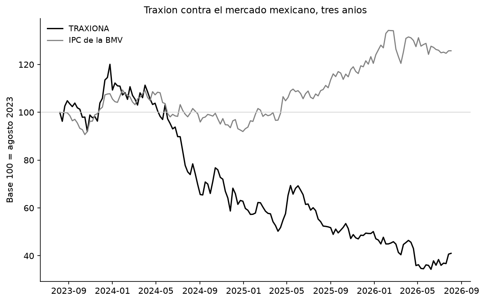
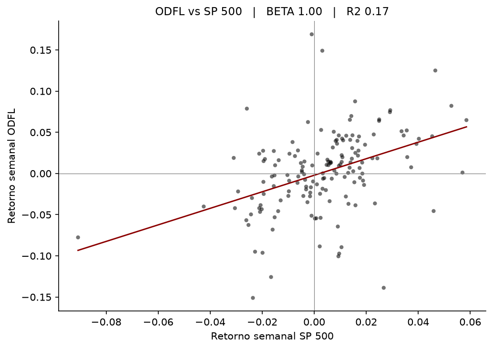
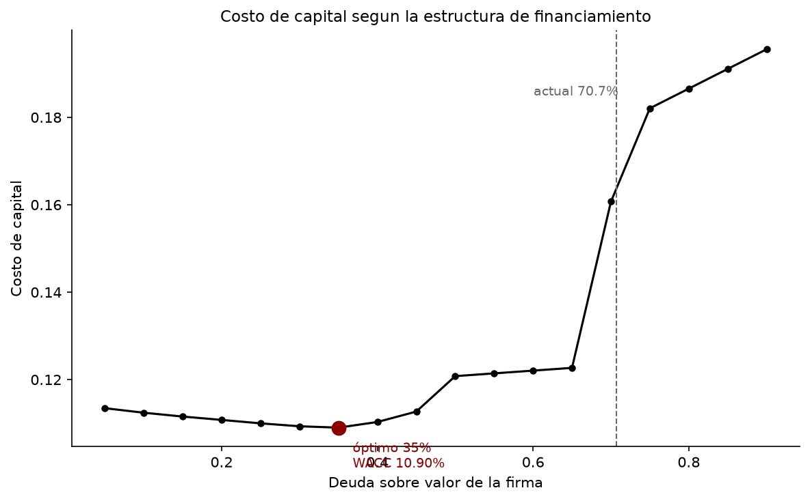
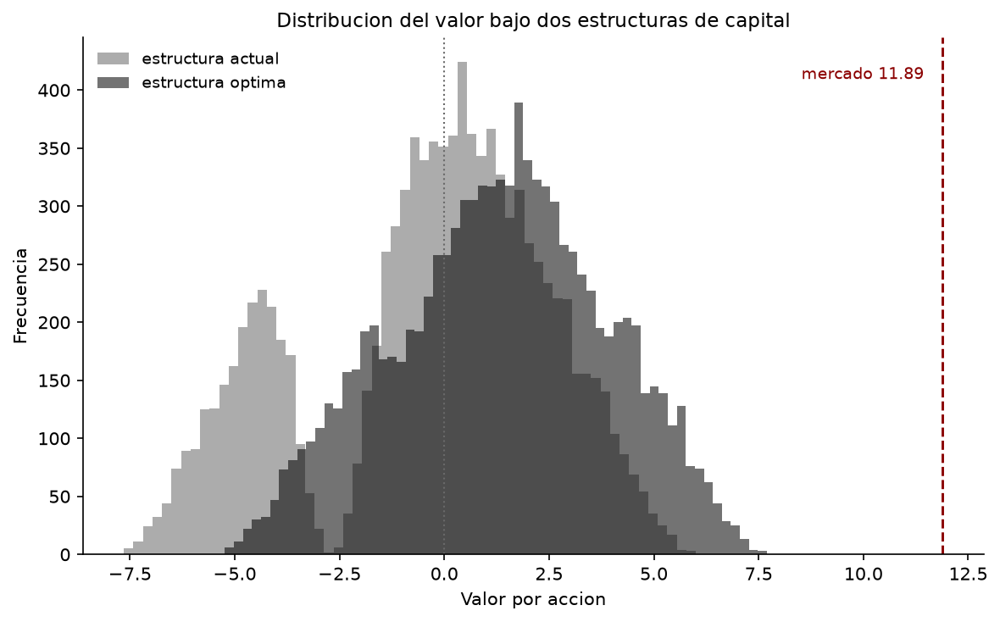

# Valoración intrínseca - Grupo Traxión (BMV: TRAXIONA)

Valoración por flujo de caja libre a la firma (FCFF).

Grupo Traxión es la empresa líder de transporte y logística en México.
Se valora como ensayo metodológico previo a la valoración de una empresa privada colombiana de transporte de pasajeros.

La empresa viene de tres años difíciles: márgenes cayendo, cobertura de intereses en mínimos y una acción que perdió cerca de 30% anual frente al mercado. En 2025 compró Solistica y su deuda llegó al 70.7% de la estructura de capital. Los valores bajos que arroja el modelo reflejan esos fundamentales.

Veáse deterioro y separación de la acción del mercado mexicano:

## Estado

Proyecto completado.

- [x] Estructura del repositorio
- [x] Serie histórica 2021-2025 transcrita y verificada
- [x] Criterio de deuda (incluye arrendamientos IFRS 16)
- [x] Partidas no recurrentes y normalización del EBIT
- [x] UDM a junio 2026 y construcción del año base
- [x] Moneda de trabajo y tasa libre de riesgo
- [x] Prima de riesgo de mercado y riesgo país
- [x] Selección de comparables para el beta ascendente
- [x] Regresiones, desapalancamiento y ponderación del beta
- [x] Costo de deuda y rating sintético
- [x] WACC
- [x] Flujo de caja libre del año base
- [x] Estructura óptima de capital
- [x] Proyección, valor terminal y valoración
- [x] Simulación de Monte Carlo

## Resultados

**Año base** (últimos doce meses a junio 2026, primeros doce meses completos con Solistica)

| Concepto | Valor |
|---|---|
| Ingresos | 38,082.2 |
| Margen operativo supuesto | 6.45% |
| EBIT base | 2,456.3 |
| Deuda ajustada | 15,935.7 |
| Patrimonio a valor de mercado | 6,610.6 |

**Costo de capital**

| Parámetro | Valor |
|---|---|
| Tasa libre de riesgo ajustada (USD) | 4.43% |
| ERP total aplicable | 6.82% |
| Beta desapalancado | 0.793 |
| Beta reapalancado | 2.131 |
| Ke en pesos | 20.71% |
| Rating sintético | B3/B− |
| kd después de impuestos | 8.87% |
| Peso de la deuda | 70.7% |
| **WACC en pesos** | **12.34%** |

**Flujo del año base**

| Concepto | Valor |
|---|---|
| NOPAT | 1,719.4 |
| Reinversión | 9.1 |
| FCFF | 1,710.3 |
| Tasa de reinversión | 0.5% |

Cifras en millones de pesos. Fecha de valoración: 7 de agosto de 2026.

**Valoración**

| | Valor de la operación | Patrimonio | Por acción |
|---|---|---|---|
| Estructura actual | 14,738.6 | 185.9 | 0.33 |
| Estructura óptima | 15,615.7 | 1,063.0 | 1.91 |
| Precio de mercado | 21,163 | 6,610.6 | 11.89 |

### El beta ascendente

El beta de regresión de Traxión no sirve como insumo: da 0.594 con un intervalo de confianza que va de 0.24 a 0.95, porque la acción negocia poco y el mercado explica apenas el 6.5% de su variación. Con ese rango el costo del patrimonio variaría casi cinco puntos porcentuales.

La alternativa es estimar el beta a partir de comparables del sector. Se corrieron regresiones semanales de tres años contra el S&P 500 sobre veinte empresas verificadas una por una.

Así se ve una de ellas. Cada punto es una semana, la pendiente de la recta es el beta y la dispersión alrededor de ella es el riesgo específico de la empresa, que un inversionista diversificado puede eliminar. Old Dominion, la comparable más limpia del grupo, da beta de 1.00 con R² de 0.175: el mercado explica el 17.5% de su movimiento y el resto es propio del negocio.

Repitiendo el ejercicio sobre las veinte, las barras grises son el error estándar de cada estimación. Se solapan entre casi todas las empresas, de modo que la diferencia entre un beta de 0.85 y uno de 1.05 no es estadísticamente distinguible. por eso el uso del enfoque ascendente, el error del promedio cae con la raíz del número de comparables n.

La mediana desapalancada del grupo de carga da 0.873 contra el 0.87 que publica Damodaran para Trucking EE.UU., calculado sobre otras 26 empresas con distinta ventana y frecuencia. Dos formas distintas sieron el mismo resultado.

### El retorno no cubre el costo de capital

Con el año base adoptado, el retorno sobre el capital invertido después de impuestos es 5.97% contra un WACC de 12.34%. Separando el crédito mercantil, que junto a los intangibles suma 28.5% del capital, el ROC sobre capital operativo sube a 8.35%: buena parte de la brecha viene del precio pagado en adquisiciones y no de la operación. Aun así ninguna base alcanza el costo de capital, y ninguno de los cuatro escenarios de margen evaluados cierra la brecha.

Cuando el retorno está por debajo del costo de capital, la reinversión destruye valor. El modelo de crecimiento fundamental va a reflejarlo.

### La empresa opera al doble de su estructura óptima

Recalculando el costo de capital para cada ratio de deuda, el mínimo está en 35% con un WACC de 10.90%. Traxión opera en 70.7%.

Al pasar de 35% a 40% la empresa lo pierde y el spread de default se duplica; entre 45% y 50% vuelve a duplicarse. Y a partir de cierto nivel el apalancamiento se realimenta: entre 65% y 70% la cobertura de intereses cae 45% al subir la deuda solo cinco puntos, porque un spread mayor eleva el gasto financiero, lo que hunde la cobertura y confirma un rating peor.

La valoración reporta dos valores, uno con cada estructura. La diferencia es el costo del sobreapalancamiento.

### El crecimiento destruye valor, y el mercado descuenta otro escenario

Mientras el retorno sobre el capital esté por debajo del costo de capital, crecer consume valor: con 0% de crecimiento el patrimonio vale 1,591 millones y con 5% vale 632. No existe ninguna tasa de crecimiento que lleve el modelo al precio de mercado.

La valoración inversa identifica qué habría que suponer para llegar a 11.89 por acción: un margen operativo de 8.74%, que supera el techo de recuperación total de los tres segmentos, o un costo de capital de 8.0%. Una combinación plausible sería margen de 7.66% con WACC de 9.5%.

El mercado descuenta el escenario de recuperación total del Módulo 1 (el más optimista de los cuatro evaluados) más un costo de capital menor. Esa segunda diferencia es la brecha entre el rating sintético de B3/B− y la calificación A+(mex) de Fitch, en valor.

### La incertidumbre es asimétrica por el apalancamiento

Diez mil simulaciones sobre el margen operativo y el crecimiento, con el costo de capital endógeno: cada iteración sortea el margen, de ahí sale la cobertura de intereses, el rating sintético y el costo de deuda. La correlación entre margen y WACC sale del modelo.

| | Estructura actual | Estructura óptima |
|---|---|---|
| Mediana | 43.6 | 791.1 |
| Desviación estándar | 1,598.5 | 1,417.0 |
| p10 | -2,688.7 | -1,239.1 |
| P(patrimonio negativo) | 48.9% | 30% |

Con la estructura actual hay casi la mitad de probabilidad de que el patrimonio no valga nada. Desapalancar mejora el valor esperado y reduce la dispersión a la vez.

El sobreapalancamiento no solo baja el valor, también concentra probabilidad en la cola mala.

En ninguna de las veinte mil corridas el valor alcanza el precio de mercado. La brecha no es un problema de estructura de capital: está en los supuestos operativos.

**El resultado es coherente con lo que ya muestran los datos de la empresa.** Un patrimonio cercano a cero suena extremo, pero corresponde a una compañía con cobertura de intereses de 1.64x, retorno sobre el capital de 5.97% contra un costo de 12.34%, márgenes que llevan tres años cayendo y una acción que perdió 30% anual frente al mercado en ese período. Si el modelo diera un valor cómodo con esos fundamentales, habría que revisarlo.

Lo que el análisis no puede afirmar es que el mercado esté equivocado. La valoración inversa muestra que el precio de 11.89 es consistente con el escenario de recuperación total de los tres segmentos y un costo de capital acorde a la calificación A+(mex) de Fitch. Ese escenario es posible; este análisis lo consideró y lo descartó por ser bastante optimista.

## Estructura

- `data/` : reportes fuente, datos intermedios y procesados
- `supuestos/traxion.yaml` : parámetros del modelo con su fuente
- `src/` : lógica de cálculo 
- `notebooks/` : narrativa del análisis
- `docs/` : bitácora de decisiones metodológicas y fuentes

Las decisiones metodológicas están documentadas en
[`docs/bitacora.md`](docs/bitacora.md).

## Notebooks

- `notebooks/costo_capital.ipynb` : regresiones de beta, desapalancamiento, ponderación, costo de deuda y WACC
- `notebooks/flujos.ipynb` : capex normalizado, capital de trabajo y flujo de caja libre del año base
- `notebooks/estructura_capital.ipynb` : cronograma de costo de capital por ratio de deuda y estructura óptima
- `notebooks/valoracion.ipynb` : proyección, valor terminal, puente al patrimonio y valoración inversa
- `notebooks/simulacion.ipynb` : simulación de Monte Carlo con costo de capital endógeno

## Metodología

Construida sobre la metodología de Aswath Damodaran (*Corporate Finance*, Stern NYU):

- Definición de deuda con arrendamientos capitalizados
- Betas ascendentes a partir de comparables cotizadas del sector
- ERP basada en precios de mercado actuales y no en el promedio histórico
- Rating sintético por cobertura de intereses, contrastado contra la calificación real
- En valor terminal, el ROC implícito y por tanto el crecimiento terminal deben ser razonables y menores a la tasa libre de riesgo

Cada supuesto lleva fuente y fecha, o se marca explícitamente como estimación.

## Decisiones metodológicas destacadas

El detalle completo está en [`docs/bitacora.md`](docs/bitacora.md).

- **Definición de deuda.** La empresa excluye los arrendamientos IFRS 16 de su "deuda total". Se reincorporan siguiendo el criterio económico de Damodaran: +14% de deuda, lo que altera ponderaciones del WACC y cobertura de intereses. Fitch reporta la misma cifra de 16,518 millones que resultó de sumar las líneas del balance, lo que confirma que el ajuste no fue una interpretación propia.

- **Discontinuidad por adquisición.** La compra de Solistica por parte de Traxion (jul-2025) parte la serie en dos. 2025 es un año híbrido (6 meses con Solistica).
Se aísla la contribución de la adquisición para medir el crecimiento real alrededor de 3%, frente al consolidado de 16%.

- **Normalización del EBIT.** Se ubica cada partida no recurrente dentro o debajo de la utilidad de operación antes de ajustarla. Al normalizar, la aparente caída de márgenes de 2024 resulta ser un efecto contable de gastos de reestructura.

- **Año base construido, no copiado.** Ningún ejercicio anual representa la empresa actual. El tamaño se toma de los últimos doce meses medidos (jul-2025 a jun-2026, primeros doce meses completos con Solistica) y el margen se decide descomponiendo la rentabilidad por segmento.

- **Construcción en dólares, flujos en pesos.** La tasa de descuento debe estar en la moneda de los flujos, pero se construye en dólares porque los insumos de calidad (ERP implícita, betas sectoriales, spreads por rating) están estimados sobre mercados en dólares. La conversión usa paridad de Fisher. El bono soberano mexicano no se usa como tasa libre de riesgo: no está libre de incumplimiento, y usarlo crudo contaría el riesgo país dos veces. Se emplea como verificación cruzada.

- **El Treasury tampoco es libre de riesgo.** Estados Unidos tiene calificación Aa1, lo que implica un spread de default de 0.22%. Se ajusta la tasa base y se traslada ese spread a la prima, aplicando a Estados Unidos el mismo criterio que con el bono mexicano.

- **La cobertura de intereses se calcula en dólares, no en pesos.** La tabla de ratings está calibrada con empresas estadounidenses, y un gasto de intereses en pesos incorpora la prima inflacionaria mexicana: a igual apalancamiento real la cobertura sale peor solo por las tasas nominales más altas. Usarla y después convertir el spread con Fisher cobraría el diferencial de inflación dos veces. La corrección mueve el rating de Caa/CCC a B3/B− y el WACC de 14.23% a 12.34%.

- **Sector de referencia verificado, no supuesto.** Se descargó el listado de compañías por industria para comprobar qué contiene cada sector en vez de inferirlo del nombre. Resultado: Trucking y Transportation son categorías paralelas y cada segmento de Traxión tiene su propia referencia. La muestra de mercados emergentes se descarta pese a que Traxión es mexicana: su R² de 1.5% y un D/E implícito de 170% indican betas sesgados por iliquidez, y el riesgo país ya entró por la prima.

- **Comparables verificadas una por una.** De 153 empresas del universo se evaluaron 91 y se incluyeron 20. Las verificaciones produjeron siete correcciones sobre la clasificación inicial hecha por sector y nombre: Universal Logistics, RXO y Landstar resultaron asset-light y pasaron a logística; Werner, ArcBest y Covenant resultaron híbridas; Ryder resultó conglomerado sin negocio dominante. Cada descarte queda documentado con su razón.

- **Sin beta separado para movilidad de personas.** No existe sector de transporte de pasajeros bajo contrato en la clasificación de Damodaran y las comparables cotizadas del nicho son inviables: Mobico está en reestructuración, Ryder y Zigup arriendan flota sin operarla, y los operadores japoneses son transporte público regulado. Se usa el beta del grupo de carga, que comparte estructura de costos fijos y contratos de largo plazo. Kelsian se conserva como verificación, no como insumo.

- **Ponderación por valor y no por ingresos.** Los múltiplos EV/ventas medianos difieren entre segmentos (carga 1.46x, personas 0.95x, logística 0.82x), de modo que un peso de ingreso no vale igual en cada negocio. Ponderando por valor estimado, logística pasa de 49.3% a 40.9% del peso: aporta la mitad de las ventas pero dos quintos del valor.

- **El rating sintético resulta más severo que la calificación real.** La cobertura de 1.64x arroja B3/B− con la tabla de empresas pequeñas, mientras Fitch afirma A+(mex), equivalente a un rango entre BB y BBB− internacional. La brecha de dos o tres escalones persiste porque la calificadora usa deuda sobre EBITDAR y pondera escala, diversificación de clientes y líneas comprometidas, factores que la tabla ignora. No se ajusta el costo de deuda: adoptar el rating de Fitch exigiría un spread en escala nacional incompatible con la construcción en dólares.

- **El retorno sobre el capital no cubre el costo de capital.** ROC de 5.97% sobre capital total y 8.35% sobre capital operativo, contra un WACC de 12.34%. Ninguno de los escenarios de margen evaluados cierra la brecha. La consecuencia es que la reinversión destruye valor, algo que el modelo de crecimiento fundamental va a reflejar.

- **La D&A no es toda reponible con capex.** Un tercio corresponde a activos arrendados bajo IFRS 16, que se reponen firmando contratos nuevos y no aparecen en el capex del estado de flujos, y un 6% es amortización de intangibles, que no se repone. Comparado contra la depreciación de activos propios, el capex de 2025 la supera en 32%: no hay subinversión, y la reinversión del año base resulta casi nula. Con una tasa de reinversión de 0.5%, el crecimiento fundamental casicero.

- **La estructura de capital actual cuesta.** El cronograma sitúa el óptimo en 35% de deuda con un WACC de 10.90%, contra el 70.7% y 12.34% actuales. El óptimo coincide con el último escalón de grado de inversión sintético. La valoración reporta el valor con ambas estructuras en vez de elegir una, porque la diferencia es diagnóstico.

- **Los supuestos de madurez cambian en bloque.** El valor terminal no usa los supuestos de hoy: el beta converge a 1, la estructura al óptimo de 35%, el ROC al costo de capital estable de 10.49% y la reinversión a g/ROC. Mezclar crecimiento de empresa madura con beta y ROC de empresa en crecimiento produce un valor terminal incoherente. Verificación: el beta desapalancado implícito en esos supuestos es 0.726, cercano al 0.793 estimado con comparables.

- **El costo de capital es endógeno en la simulación.** En vez de correlacionar margen y WACC, cada iteración deriva la cobertura de intereses del margen sorteado, de ahí el rating sintético y el costo de deuda. La correlación sale del modelo, no de un supuesto.

## Datos

- `data/interim/traxion_anual.csv` : serie histórica 2021-2025 más UDM a jun-2026
- `data/interim/universo_comparables.csv` : 153 empresas del listado de Damodaran
- `data/interim/comparables.csv` : selección final con verificación de negocio y razón de cada descarte

La procedencia de cada dato está en [`docs/fuentes.md`](docs/fuentes.md).

## Reproducibilidad

El proyecto tiene dos clases de insumos y solo una es reproducible al pie de la letra.

**Congelados.** Los estados financieros de Traxión están en `data/raw/` como los publicó la empresa, con las páginas mapeadas en [`docs/fuentes.md`](docs/fuentes.md).
Los archivos de Damodaran también: su página `datacurrent.html` se actualiza frecuentemente, por eso se conservan localmente con la fecha de corte en el nombre. Cualquiera puede rehacer la serie histórica, la normalización del EBIT, el año base y el costo de capital y llegar a los mismos números.

**No congelados.** Los precios, la deuda, la capitalización de mercado y los ingresos de las veinte comparables se descargan en tiempo de ejecución con `yfinance`. Esos datos cambian.

Ejemplo: En la celda de múltiplos EV/ventas. El texto de la ponderación usa carga 1.46x, personas 0.95x y logística 0.82x, que son los valores a la fecha de valoración y los que producen los pesos de 40.9% / 29.6% / 29.5% del beta desapalancado de 0.793. Una corrida posterior devuelve otros múltiplos y otros pesos.

## Instalación

    python -m venv .venv
    .venv\Scripts\Activate.ps1
    pip install -r requirements.txt