# Bitácora de decisiones metodológicas

Registro de hallazgos, criterios aplicados y decisiones de modelación.

Orden cronológico inverso: la entrada más reciente primero.

Formato: fecha, qué se encontró o decidió, en qué se basa, qué implica para el resto del modelo.

## 2026-08-23 - Corrección al costo de deuda y al ROC

Dos ajustes tras revisar el Módulo 2.

**Cobertura de intereses en moneda consistente.** La tabla de ratings de Damodaran está calibrada con empresas estadounidenses que se endeudan en dólares. El gasto de intereses de Traxión está en pesos e incorpora la prima inflacionaria mexicana: a igual apalancamiento real, una empresa mexicana muestra menor cobertura solo porque sus tasas nominales son más altas. Usar esa cobertura y después convertir el spread a pesos con Fisher pone el diferencial de inflación dos veced.

Se convierte el gasto de intereses a su equivalente en dólares antes de buscar el rating. 

Se ajusta y corrige el notebook costo_capital.ipynb

| | Antes | Después |
|---|---|---|
| Cobertura | 1.40x | 1.64x |
| Rating sintético | Caa/CCC | B3/B− |
| Spread | 8.85% | 5.09% |
| kd en pesos | 16.48% | 12.67% |
| kd después de impuestos | 11.54% | 8.87% |
| WACC | 14.23% | 12.34% |

El contraste con Fitch se estrecha: frente a A+(mex), que equivale más o menos a BB o BBB- internacional, la brecha pasa de cinco escalones a dos o tres.

**ROC separando crédito mercantil.** El ROC sobre capital total mezcla dos diagnósticos: si el negocio rinde y si las adquisiciones salieron caras.

| Base de capital | Capital | ROC |
|---|---|---|
| Total | 28,813.6 | 5.97% |
| Sin crédito mercantil | 23,516.3 | 7.31% |
| Sin crédito mercantil ni intangibles | 20,596.4 | 8.35% |

Crédito mercantil e intangibles suman 8,217, el 28.5% del capital invertido. Una parte de la brecha viene del precio pagado en adquisiciones y no de la operación. Aun así, en ninguna base el ROC alcanza el WACC.

## 2026 - 08 - 22 Modulo 2: Costo de capital

Cálculo completo en `notebooks/costo_capital.ipynb`.

### Beta ascendente

Regresiones semanales de tres años contra el S&P 500 sobre las veinte comparables. Todas con 156 observaciones.

| Grupo | n | Beta apalancado | Beta desapalancado |
|---|---|---|---|
| Carga | 11 | 0.950 | 0.873 |
| Logística | 8 | 0.926 | 0.677 |

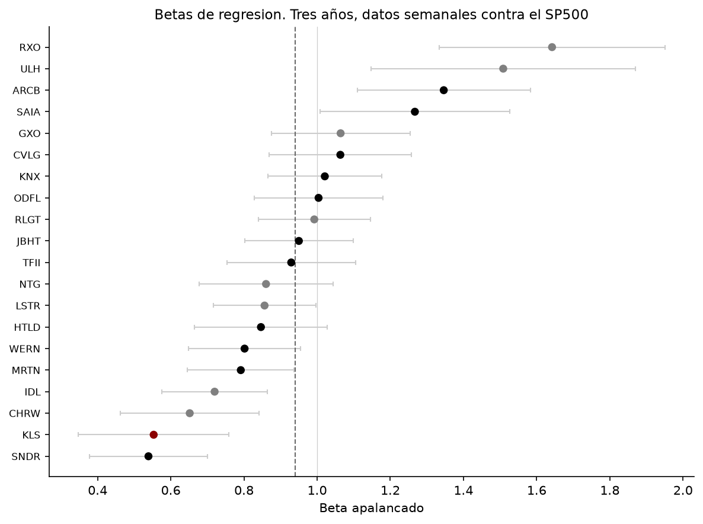

El R2 promedio de 15.2% supera el 13.1% de Damodaran para Trucking EE.UU. Pero el error estándar promedio de 0.19 hace que los intervalos de casi todas las empresas se solapen, así que ninguna estimación individual sirve sola.

La mediana desapalancada de carga da 0.873 contra el 0.87 que publica Damodaran, calculado sobre otras 26 empresas con otra ventana. Dos caminos independientes al mismo número.

Se usa mediana y no media porque RXO (1.438) arrastra el promedio de logística.

**Contraste con el beta propio de Traxión.** Contra el S&P 500 da 0.594 con R2 de 6.5% e intervalo de 0.24 a 0.95. Contra el IPC sube a 0.741 con R2 de 10.4%, así que parte del problema es el índice pero la mayor parte es la acción. Con ese intervalo el Ke variaría casi cinco puntos, que es justamente lo que justifica el enfoque ascendente.

### Ponderación

Los múltiplos EV/ventas medianos difieren: carga 1.46x, personas 0.95x, logística 0.82x. Aplicándolos a los ingresos de cada segmento:

| Segmento | Por ingresos | Por valor |
|---|---|---|
| Logística | 49.3% | 40.9% |
| Carga | 20.0% | 29.6% |
| Personas | 30.7% | 29.5% |

Logística aporta la mitad de las ventas pero dos quintos del valor, coherente con sus márgenes de 2-3%.

Beta desapalancado = 0.409 * 0.677 + 0.591 * 0.873 = 0.793

Por ingresos habría dado 0.776, unos 12 puntos básicos de diferencia en el Ke.

### Reapalancamiento y costo del patrimonio

Precio de 11.89 y 555,980,425 acciones dan un patrimonio de mercado de 6,610.6 millones. Contra deuda de 15,935.7, el D/E queda en 241% y la deuda pesa 70.7% de la estructura.

BETAL = 0.793 * [1 + 0.70 * 2.411] = 2.131
Ke (USD) = 4.43% + 2.131 * 6.82% = 18.96%
Ke (MXN) = 20.71%

La mediana de D/E de las comparables es 19%. Traxión está muy por encima por la deuda de Solistica y por la caída del precio de la acción, que acumuló un alfa de −30% anual en tres años.

### Costo de deuda

Cobertura = 2,456.3 / 1,753.8 = 1.40x

Se usa el EBIT del año base y no el de los UDM, por consistencia con los flujos que se van a proyectar. Con el UDM la cobertura baja a 1.23x y el rating cae un escalón, lo que queda como sensibilidad.

Se aplica la tabla de empresas pequeñas: Traxión capitaliza unos 350 millones de dólares, muy por debajo del umbral de 5,000.

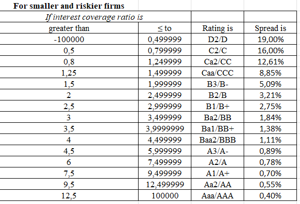

Rating sintético: Caa/CCC, spread 8.85%
kd (USD) = 4.43% + 1.52% + 8.85% = 14.80%
kd (MXN) = 16.48%
kd después de impuestos = 11.54%

El gasto de intereses incluye los arrendamientos IFRS 16: no hay línea separada en el estado de resultados y la norma obliga a reconocerlos. La tasa implícita lo confirma, 11.01% sobre la deuda total contra 12.51% si cubriera solo la financiera.

La tasa de la deuda ya contratada (11.01%) queda cinco puntos por debaj del kd marginal. La brecha refleja el deterioro del perfil crediticio desde que se tomó esa deuda.

### Contraste con Fitch

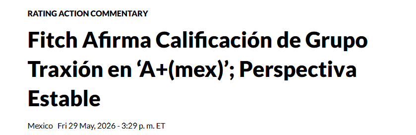

Fitch afirmó el 29 de mayo de 2026 la calificación en A+(mex), perspectiva estable, contra un sintético de Caa/CCC.

Las escalas no son comparables: la nacional mide riesgo relativo dentro de México con techo en el soberano, mientras el sintético es escala internacional. Un A+(mex) equivale más o menos a BB o BBB- internacional, así que la brecha real es de cuatro o cinco escalones.

Aun así persiste. Fitch usa deuda sobre EBITDAR, que proyecta en 3x para2026 y 2.5x hacia 2028, no cobertura de intereses sobre EBIT. Y pondera cosas que la tabla ignora: liderazgo en los tres segmentos, top diez clientes por debajo del 15% de ingresos con ninguno sobre 3%, líneas omprometidas por 2,500 millones.

No se ajusta el costo de deuda por esto. Adoptar el rating de Fitch exigiría un spread en escala nacional, incompatible con la construcción en dólares. La brecha queda para el Monte Carlo.

**Validación del criterio de deuda.**

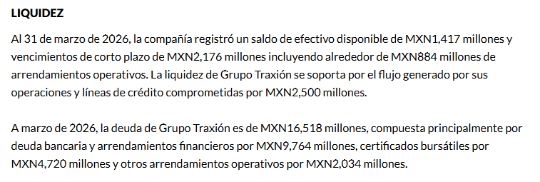

Fitch reporta la deuda a marzo de 2026 en 16,518 millones: deuda bancaria y arrendamientos financieros por 9,764, certificados bursátiles por 4,720 y otros arrendamientos operativos por 2,034. Es la misma cifra construida en el Módulo 1 sumando las líneas del balance. Reincorporar los arrendamientos que la empresa excluye no fue interpretación propia sino tambien el criterio de la calificadora.

**Validación del margen base.** Fitch proyecta margen EBITDAR cerca de 15% para 2026. Con D&A de 3,111.4 sobre ingresos de 38,082.2, eso implica un margen operativo del orden de 6.8%, cerca al 6.45% adoptado por otra vía.

### WACC

WACC = 20.71% * 29.3% + 11.54% * 70.7% = 14.23%

Ponderaciones a valor de mercado. El WACC queda cerca del costo de deuda porque el patrimonio pesa apenas tres décimas.

**Queda abierto** si la valoración usa la estructura actual o una objetivo.
El 70.7% refleja la deuda de Solistica y la caída de la acción. La empresa
anunció desapalancar y Fitch proyecta la razón bajando a 2.5x. Modulos futuros daran el optimo.

### El retorno no cubre el costo de capital

Capital invertido = 15,935.7 + 14,260.9 − 1,383.0 = 28,813.6
ROC = 2,456.3 * 0.70 / 28,813.6 = 5.97%
WACC = 14.23%
Diferencia = -8.26 puntos

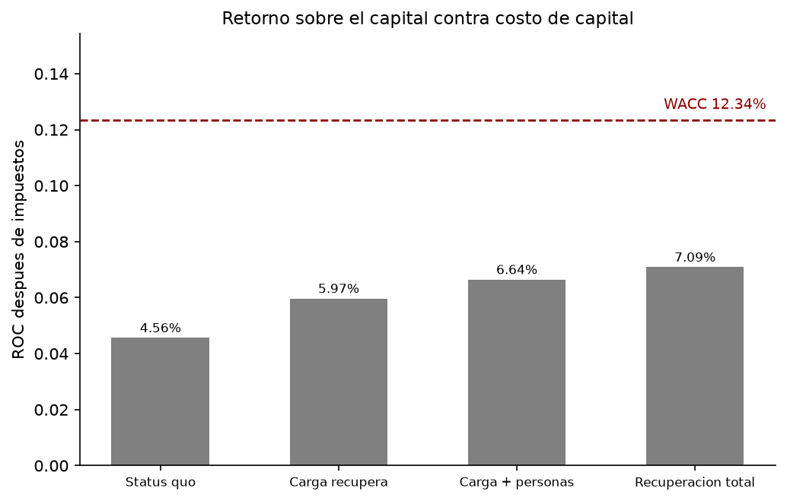

Ninguno de los cuatro escenarios de margen cierra la brecha. Con recuperación total de los tres segmentos el ROC llega a 7.09%, la mitad del WACC.

El capital invertido usa patrimonio contable, no de mercado: mide el capital efectivamente puesto a trabajar.

Coincide con lo que dice el mercado: alfa de −30% anual y múltiplo EV/ventas de 0.56x contra 1.46x de mediana en las comparables de carga.

### Resultados

| Parámetro | Valor |
|---|---|
| Beta desapalancado | 0.793 |
| Beta reapalancado | 2.131 |
| Ke en pesos | 20.71% |
| Rating sintético | Caa/CCC |
| kd después de impuestos | 11.54% |
| Peso de la deuda | 70.7% |
| WACC en pesos | 14.23% |

## 2026-08-17 - 2026-08-20 - Beta ascendente: selección de comparables

Verificación empresa por empresa del universo de 153 extraído del listado de compañías por industria de Damodaran. Resultado en `data/interim/comparables.csv`: 91 empresas evaluadas, 20 incluidas y 71 descartadas con razón documentada.

### Resultado

| Grupo | Empresas |
|---|---|
| Carga | 11 |
| Logística | 8 |
| Personas | 1 |

**Carga:** Heartland, Marten, Old Dominion, Saia (100%), J.B. Hunt (91%), Knight-Swift (85%), TFI International (80%), Schneider (75%), Werner (69%), ArcBest (68%), Covenant (63%).

**Logística:** Landstar, RXO, Radiant, GXO, ID Logistics (100%), C.H. Robinson (91%), NTG (78%), Universal Logistics (67%).

**Personas:** Kelsian (83%).

### Criterios de descarte aplicados

Cuatro categorías, aplicadas de forma consistente:

**1. Mezcla de negocio.** El negocio comparable no domina, o la empresa opera en otra industria.

**2. Liquidez insuficiente.** La negociación delgada sesga el beta a la baja porque el precio no se actualiza.

**3. Historia insuficiente.** Menos de tres años de cotización.

**4. Eventos corporativos que rompen la serie.** El beta del período mide la reacción del mercado al evento, no el riesgo del negocio.

### Criterio para comparables híbridas

Varias comparables combinan operación con flota propia (asset-based) y brokerage con activos de terceros (asset-light). Se incluyen en carga
cuando el componente asset-based supera el 50%, aunque no llegue al umbral general de 70%.

Razón: Traxión también es híbrida de modo que una comparable con structura mixta refleja mejor su perfil que un LTL puro.

La distinción no es contable sino de estructura de costos, y afecta el beta directamente: la operación con flota propia tiene costos fijos que no bajan cuando cae el volumen (depreciación, conductores de planta, terminales), lo que amplifica la caída del margen. El brokerage paga por viaje. Mayor apalancamiento operativo implica mayor beta.

Se conserva el porcentaje asset-based de cada comparable para verificar después si los betas se ordenan según esa columna. Si lo hacen, confirma el efecto y da un argumento para el beta de Traxión, que se está moviendo hacia asset-light.

### Exclusión de las comparables brasileñas

Se descartan JSL, Tegma, Vamos, Localiza, Movida y Sequoia como grupo.

Los betas reportados para las transportadoras brasileñas son
implausiblemente bajos: JSL 0.36 y Tegma 0.16 (cinco años, mensual),
frente a Trucking EE.UU. 1.01 y global 0.85. Tegma está financieramente
sana (BPA +3.85, P/E 8.78, spread 0.6%), de modo que el problema no es de
la empresa sino de la medición: negociación relativamente delgada e
Ibovespa dominado por commodities y bancos, que no representa la
exposición económica de una transportadora.

Es el mismo fenómeno que llevó a descartar la muestra sectorial de
mercados emergentes de Damodaran (β desapalancado 0.37, R² de 1.5%). Los
dos casos verificados individualmente confirman que el argumento no era
teórico.

### Decisión: no se estima beta separado para movilidad de personas

No existe sector de transporte de personas bajo contrato en la clasificación de Damodaran, y la búsqueda de comparables cotizadas produjo un grupo inviable:

- Kelsian (Australia): buena comparable, 83.3% autobús bajo contrato, incluido charter corporativo, gubernamental y del sector educativo en EE.UU.
- Mobico (Reino Unido): negocio adecuado pero en reestructuración profunda; el precio refleja riesgo de solvencia
- Ryder, Zigup, Vamos: renta de flota sin operación
- Operadores japoneses de autobús: transporte público con tarifas reguladas, en bolsas regionales, con posibles negocios inmobiliarios

Estimar un beta sobre ese conjunto produciría un número específico pero poco confiable.

**Se adopta el beta del grupo de carga para movilidad de personas.** Ambos segmentos operan flota propia con conductores de planta bajo contratos de largo plazo, y comparten la estructura de costos fijos que determina el apalancamiento operativo. Difieren en ciclicidad de la demanda lo que sugiere que el beta aplicado sobreestima levemente el riesgo de ese segmento.

**Kelsian se conserva como verificación, no como insumo.** Se calculará su beta individual y se comparará contra el del grupo de carga. Si resulta similar, confirma que la aproximación era razonable; si difiere mucho, es un dato para sensibilidad.

La ponderación queda en dos grupos:

    β = 49.3% * β_logística + 50.7% * β_carga

donde 50.7% = carga (20.0%) + personas (30.7%), según la mezcla de ingresos de 6M26.

**Decisión: índice, ventana y frecuencia**

Previamente se planteo la posibilidad de usar un solo indice global. Sin ebargo, tras los resultados obtenidos en comparables.csv se decide:

- Índice: S&P 500
- Ventana: 3 años
- Frecuencia: semanal (156 observaciones)

**Índice.** Se regresa contra el S&P 500 y no contra un índice global, pese a que tres comparables no son estadounidenses. Razón principal: la ERP adoptada es la implícita del S&P 500 (4.28%), y en el CAPM el beta y la prima deben medirse contra el mismo mercado. Un beta contra un índice global multiplicando una prima del S&P 500 mezclaría dos definiciones de mercado. Además permite comparar el resultado con los betas sectoriales de Damodaran, que se estiman contra índices locales, y 17 de las 20 comparables cotizan en Estados Unidos.

**Ventana.** Tres años, dentro del rango estándar de 2 a 5. Tres razones:
- una ventana de 5 años excluiría algunas comparables de calidad
- el sector está en transición rápida hacia modelos asset-light (Universal Logistics pasó de 49.9% a 67.3% de logística en dos años) de modo que una ventana larga promedia empresas distintas
- el período 2021-2022 fue excepcionalmente favorable para el autotransporte norteamericano por la congestión post-pandemia, y mezclarlo con la corrección posterior combinaría dos regímenes.

**Frecuencia.** Semanal. Dividir más los datos los vuelve ruidosos; mensual sobre 3 años daría solo 36 observaciones.

Se registra como sensibilidad: correr también la ventana de 5 años sobre las comparables que la permitan, para verificar cuánto cambia el beta promedio.

## 2026-08-14 - Beta ascendente: sectores de referencia, decisiones y universo de comparables

Traxion cotiza, por lo que cuenta con un beta de regresión propio. No se usa como insumo por el error estandar naturalmente alto de una sola regresión. Ek promedio de muchas regresiones comparables reduce ese error con $\sqrt{n}$.

El beta de regresión de Traxion se calculará como contraste.

Traxion opera tres negocios:

Logistica y tecnología
Movilidad de carga
Movilidad de personas

Segun 6M26 en traxion_2T26_trimestral.pdf, el peso en los ingresos es de: 

Logistica y tecnología: 9073/18408 = 49.29%
Movilidad de carga: 3679/18408 = 19.9%
Movilidad de personas: 5656/18408 = 30.7%
Se usa esta mezcla de 6M26 ya que la empresa hacia adelante se parece más al semestre más reciente que al promedio del ultimo año, y dicha mezcla se esta moviendo hacia logistica.

El metodo ascendente estandar: desapalancar por negocio y ponderar.

Se hará busqueda global, pues el riesgo país de Mexico ya entró por el CRP de 2.32%; buscar comparables mexicanas lo contaría dos veces.

### Verificación de betas sectoriales:

Archivos descargados en dataraw:

- `damodaran_betas_sector_us_ene2026.xls`
- `damodaran_betas_sector_global_ene2026.xls`
- `damodaran_betas_sector_emergentes_ene2026.xls`
- `damodaran_industry_company_listing_ene2026.xls`

**Muestra de EE.UU / Trucking**

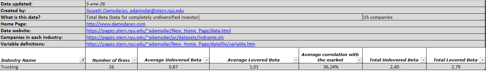

**Muestra Global / Trucking**

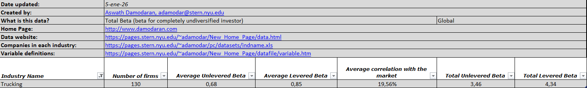

**Muestra de Emergentes / Trucking**

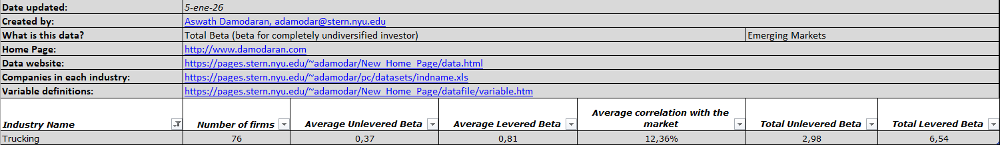

**Muestra de EE.UU / Transportation**

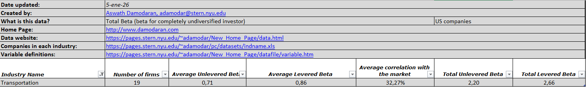

**Muestra Global / Transportation**

**Muestra Global / Auto y Truck**

| Sector | Muestra | Empresas | Beta desapalancado | Beta apalancado | Correlación | Beta total desapalancado |
|---|---|---|---|---|---|---|
| Trucking | EE.UU | 26 | 0.87 | 1.01 | 36.24% | 2.40 |
| Trucking | Global | 130 | 0.68 | 0.85 | 19.56% | 3.46 |
| Trucking | Emergentes | 76 | 0.37 | 0.81 | 12.36% | 2.98 |
| Transportation | EE.UU | 19 | 0.71 | 0.86 | 32.27% | 2.20 |
| Transportation | Global | 451 | 0.75 | 0.96 | 16.94% | 4.41 |
| Auto y Truck | Global | 165 | 1.15 | 1.41 | 20.49% | 5.59 |

### Verificación del contenido de cada sector

La descarga de `damodaran_industry_company_listing_ene2026.xls` responde a verificar el listado de compañias por industria. En lugar de suponerlo por el nombre.

Trucking es homogeneo, autotransporte terrestre.
Transportation es mixto: Incluye renta de autos e incluso tambien plataformas tecnologicas como Uber, Lyft, etc.

Un hecho importante es que Damodaran clasifica a Traxion en Trucking:

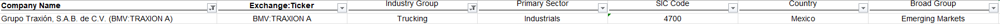

**Decisión**

Movilidad de carga: Trucking
Logistica y tecnología: Transportation
Movilidad de personas: Ninguno exacto, Transportation puede ser la referencia ya que aca estan clasificados los operadores de transporte de pasajeros identificados como Kelsian, Mobico, etc. Sin embargo, es una referencia debil pues, como se menciono anteriormente, el beta del sector esta contaminado por que sale de un promedio que incluye plataformas como Uber y otras, las cuales no se parecen a transporte bajo contrato.
El beta de este segmento tendrá más incertidumbre que los otros, candidato para sensibilidad.

Sectores descartados: Auto y Truck que son fabricantes de vehiculos; Air Transport, ya que Traxion no opera transporte aereo; Transportation (Railroads), negocio regulado y perfil muy distinto.

### Elección de la muestra: EE.UU

El $\beta$ desapalancado de Trucking varia de 0.37 a 0.87 según región. Diferencia explicada en parte por la calidad estadistica de la muestra:

Trucking EE.UU: 
Correlación = 36.24%
R2 implicito = 0.3624*0.3624 = 0.1313 = 13.1%
D/E implicito = (Beta apalancado / Beta desapalancado -1) / (1-t) = (1.01 / 0.87 - 1) / (1-0.25) = 21.5%  (asumiendo una tasa marginal de 25% para global y EE.UU, y 30% para emergentes)

Trucking Global:
Correlación = 19.56%
R2 = 3.8%
D/E = 33.3%

Trucking Emergentes:
Correlación = 12.36%
R2 = 1.5%
D/E = 169.9%

Tras esto, la referencia principal sera la de Trucking de EE.UU de un $\beta$ desapalancado de **0.87**.
Como referencia secundaria Trucking global de 0.68.
El $\beta$ ascendente propio que se construya deberia estar cerca a 0.68 y 0.87.

Se descarta Emergentes a pesar de que Traxion es Mexicana. Como se menciono anteriormente, el riesgo país ya entro por el CRP; el R2 de 1.5% significa que el mercado explica apenas el 1.5% de la variación, y el D/E implicito es demasiado alto con deuda de casi el doble del patrimonio, contra un 21% en EE.UU.

El promedio ponderado de los tres negocios de Traxion puede diferir legitimamente del sectorial. La verificación es de maginitud.

### Universo

Del archivo `damodaran_industry_company_listing_ene2026.xls` se extrajo el universo de partida: 153 empresas en Trucking y Transportation, exluyendo 15 empresas que cotizan en mercado extrabursatil.

Guardado en data/interim/universo_comparables.csv

| Sector | Empresas | Mercados principales |
|---|---|---|
| Trucking | 51 | EE.UU 21, Japón 17, Brasil 4, Canada 3 |
| Transportation | 102 | Japón 31, EE.UU 15, Australia 7, Francia 7, Brasil 6 |

Criterio para incluir una empresa en la selección final:

1. Liquidez razonable
2. Negocio principal comparable
3. Al menos 3 años de historia de precios para las regresiones
4. Estados financieros accesibles, pues se necesita para desapalancar

Al menos 10 empresas de calidad por grupo. El grupo de movilidad de personas probablemente no alcance a las 10.

De la lista preliminar de candidatos en 2026-08-10 se confirman los siguientes:

Trucking: Landstar, Werner, Heartland, Old Dominion, Saia, J.B. Hunt, Knight-Swift, Schneider, XPO, Marten, ArcBest, Ryder, RXO, Covenant, Universal Logistics (EE.UU.); JSL, Simpar, Tegma, Vamos (Brasil); TFI International, Mullen Group (Canadá); NTG Nordic Transport (Dinamarca); STEF (Francia); Lindsay Australia.

Transportation: C.H. Robinson, Expeditors, GXO, Hub Group, Forward Air, FedEx, UPS, Radiant Logistics (EE.UU.); DSV (Dinamarca, CPSE:DSV); Deutsche Post (Alemania); ID Logistics (Francia); Mobico Group (Reino Unido); Mainfreight, Freightways (Nueva Zelanda); Localiza, Movida, Sequoia (Brasil).

Hallazgo para el grupo de movilidad de personas. El listado japonés de Transportation incluye operadores de autobuses: Hokkaido Chuo Bus, Shinki Bus, Kanagawa Chuo Kotsu, Niigata Kotsu, Daiichi Koutsu Sangyo. También Kelsian Group (Australia), que opera autobuses bajo contrato. Son los comparables más cercanos encontrados hasta ahora para ese segmento

Nota: comparables.csv sera para la selección final con la verificación de negocio.

## 2026-08-10 - BETA: Definir los comparables

La metodología utilizada será la misma recomendada por Damodaran: Beta ascendente de comparables.

Traxion abarca tres negocios distintos:
- logistica y tecnologia
- movilidad de carga
- movilidad de personas

Dicha metodología exige un beta desapalancado por cada negocio y proceder a ponderar.

Busqueda de empresas comparables:

Logística y tecnología:

Estados Unidos: C.H. Robinson, Expeditors International, Hub Group, Landstar System, GXO Logistics, Forward Air
Europa: DSV, Kuehne+Nagel, Deutsche Post DHL
Brasil: Sequoia, Armac

Movilidad de carga

Estados Unidos: J.B. Hunt, Knight-Swift, Werner Enterprises, Schneider National, Heartland Express, Marten Transport, Old Dominion, Saia, XPO
Brasil: JSL, Simpar, Tegma

Movilidad de personas 

Reino Unido: FirstGroup, Mobico Group 
Brasil: Movida, Localiza (renta de flota)

Se listan estas posibles empresas como comparables para empezar la busqueda y adecuación. Sin embaergo, el objetivo será contar con 10 o 15 empresas por grupo.
En el proceso se adjuntaran comparables.csv
De igual forma, se debe decidir contra qué indice regresar. sp500?. Si se mezclan muchos paises se podría usar un índice global unico.

## 2026-08-10 - Corrección de tasa libre de riesgo y elección de ERP

Ke = Rf + $\beta$ * (ERP madura + CRP)

Se obtuvo: 

Rf (Treasury 10 años) 4.65%	
ERP madura 4.23%	
CRP México 2.32%

Sin embargo, hay que hacer ajustes: 
Para la ERP Damodaran publica cinco estimaciones, veáse:

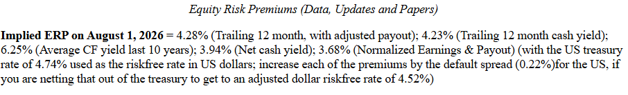

El rango va de 3.68% a 6.25%. Rango para MonteCarlo.
Se usará la de los flujos de los útltimos 12 meses, con el reparto ajustado a niveles sostenibles. Es decir: 4,28%.

Damodaran advierte que Estados Unidos tiene calificación Aa1, no Aaa, lo que implica un spread de default de 0.22%. por eso da una tasa ajustada.

Es el mismo criterio ya aplicado al Bono M mexicano.
Aplicarlo a México y no a Estados Unidos sería inconsistente.

**Decisión:** se ajusta la tasa propia de la fecha de valoración, no la de Damodaran, para mantener el anclaje temporal ya declarado (7 de agosto).

    Rf ajustada  = 4.65% - 0.22% = 4.43%
    ERP ajustada = 4.28% + 0.22% = 4.50%

El ajuste traslada el riesgo soberano estadounidense de la tasa base a la prima.

La causa dominante es la fecha: el spread de México es de enero de 2026, siete meses anterior a la valoración, en un período con choque de energéticos y presión sobre el peso. El diferencial implícito calculado con datos de agosto es 2.98%, no 1.52%.

**Verificación alterna con el spread implícito de agosto:**

Bono M - residuo = 9.12% - 2.98% = 6.14%
Fisher con Rf ajustado = 5.96%
Diferencia = 18 pb

El problema esta en la antiguedad.

**Diagnóstico de la brecha.** El residuo entre el Bono M y el Treasury convertido es 2.98% con datos de agosto, contra un spread publicado de 1.52% con fecha de enero. Ese residuo no es spread de default puro: contiene también la desviación de la paridad de Fisher y diferencias de liquidez y plazo. nom se toma como estimación.

Lo que sí permite afirmar es que el spread de default de México a la fecha de valoración está acotado entre 1.52% y 2.98%. Rango para MonteCarlo.

### La verificación cruzada ya no pasa el umbral

Rehecha con la Rf ajustada:

    Via (a): Bono M − spread CDS = 9.12% − 1.52% = 7.60%
    Via (b): Fisher con Rf ajustada = (1.0443 * 1.0375)/1.0225 − 1 = 5.96%
    Diferencia: 164 puntos

### CRP

La metodologia de Damodaran explica que no todas las empresas de un país están igualmente expuestas a su riesgo. La medida más simple es la proporción de ingresos generados en el país. Sin embarego, ya que la totalidad de los activosde Traxion estan en MExico, y que la empresa concentro a posta su exposición: el 1 de julio de 2025 adquirió Solistica con operaciones en México, Brasil y Colombia, y vendió las dos últimas el mismo día para enfocarse en México.

Se aplica el CRP integro de 2.32%.

            FINALMENTE SE DECIDE:

Ke (en dólares) = 4.43% + $\beta$ * (4.50% + 2.32%)
                = 4.43% + $\beta$ * 6.82%

## 2026-08-07 - Módulo 2 iniciado: moneda y tasa libre de riesgo

Fuente metodológica: Damodaran, tasa libre de riesgo y consistencia de
monedas.

Fecha de valoración

Se declara el **7 de agosto de 2026** como fecha de valoración.

el año base son los últimos doce meses de operación disponibles (jul-2025 a jun-2026, del reporte 2T26), pero la valoración se hace a fecha de hoy. Es la práctica estándar: se valora con los estados financieros más recientes publicados, no se espera al siguiente cierre.

Consecuencia: todos los datos de mercado, tasas, primas, spreads y el precio de la acción para la verificación final, se toman a esta misma¿ fecha. Mezclar tasas de una fecha con precio de otra descuadra la comparación del Módulo 7.

### Decisión de moneda

**El principio:** la tasa de descuento debe estar en la misma moneda que
los flujos. Traxión reporta en pesos mexicanos nominales, así que los
flujos van en MXN y la tasa que los descuenta también.

(a) Directo en pesos: Rf, ERP y prima país estimadas en MXN.
(b) Construir el costo de capital completo en dólares y convertirlo a pesos con el diferencial de inflación esperada (paridad de Fisher).

**Decisión: ruta (b).**

Razón: los insumos de mayor calidad como ERP implícita, betas sectoriales desapalancados, spreads por rating, primas de riesgo país, están estimados sobre mercados denominados en dólares. Construir en pesos obligaría a improvisar equivalentes locales de peor calidad.

**Implicación para el código:** las funciones de costo de capital
reciben la moneda de trabajo y las inflaciones esperadas como parámetros
explícitos, de modo que el modelo pueda correrse en ambas monedas y
compararse.

### Datos recolectados

| Dato | Valor | Fuente | Fecha |
|---|---|---|---|
| Treasury EE.UU. 10 años | 4.65% | US Treasury, Daily Par Yield Curve | 07/08/2026 |
| Bono M mexicano (venc. 21/02/36) | 9.12% | Banxico, YTM calculado desde precio | 06/08/2026 |
| Inflación esperada USD (10 años) | 2.25% | FRED, serie T10YIE | 07/08/2026 |
| Inflación esperada MXN (5-8 años) | 3.75% | Banxico, Encuesta jul-2026, Cuadro 5 | 03/08/2026 |
| Spread de default México (rating) | 1.62% | Damodaran, ctryprem (Baa2) | 01/01/2026 |
| Spread de default México (CDS) | 1.52% | Damodaran, ctryprem (neto de CDS suizo) | 01/01/2026 |

TREASURY ESTADOUNIDENSE 10 AÑOS

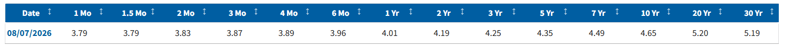

https://home.treasury.gov/resource-center/data-chart-center/interest-rates/TextView?type=daily_treasury_yield_curve&field_tdr_date_value=2026

M-BONO MXN A 10 AÑOS

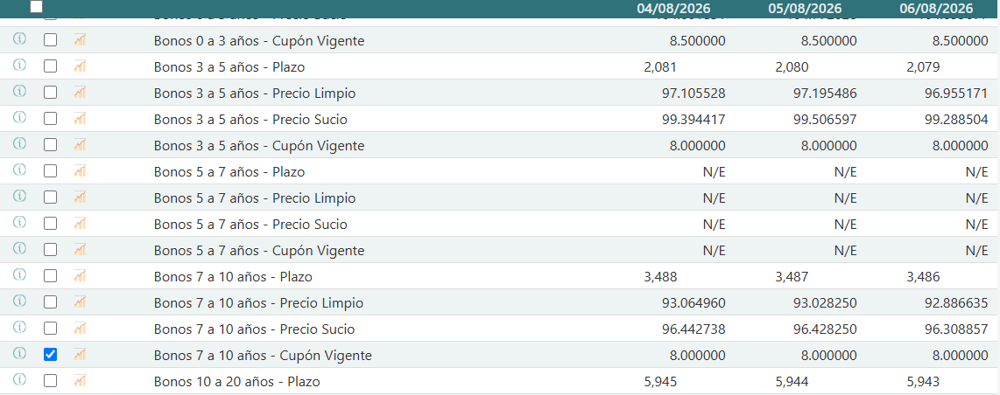

Banxico publica precio, no rendimiento. El YTM se calcula desde el precio sucio (96.308857), cupón vigente (8.00%) y plazo residual (3,486 días) del bono con vencimiento 21/02/2036.

https://www.banxico.org.mx/SieInternet/consultarDirectorioInternetAction.do?accion=consultarCuadro&idCuadro=CF300&sectorDescripcion=Mercado

VERIFICACIÓN: Cbonds, Mexico 10Y YTM = 9.129% al 07/08/2026

https://cbonds.com/indexes/24265/

INFLACIÓN ESPERADA A 10 AÑOS USD

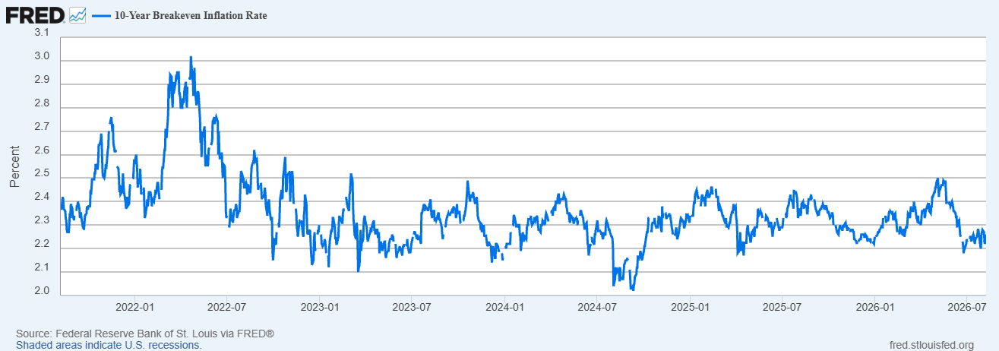

2.25% al 07/08/2026

https://fred.stlouisfed.org/series/T10YIE

INFLACIÓN ESPERADA A 5-8 AÑOS MXN

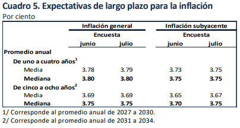

Se usa la mediana: 3.75%

https://www.banxico.org.mx/publicaciones-y-prensa/encuestas-sobre-las-expectativas-de-los-especialis/%7B9A769BA5-F259-4032-8399-BAE68C36ABFA%7D.pdf

Spread de default de Mexico

DAMODARAN:

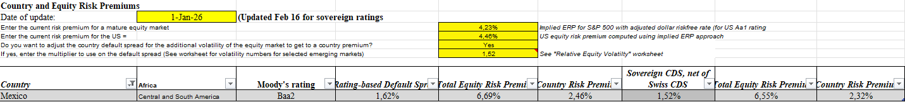

https://pages.stern.nyu.edu/~adamodar/New_Home_Page/datafile/ctryprem.html

### El Bono M: por qué hubo que calcular el rendimiento

Banxico publica **precio**, no rendimiento. Del vector de precios se tomó el Bono M con vencimiento 21/02/2036, que al 06/08/2026 tenía 3,486 días
residuales (**9.55 años**), el más cercano a diez de los cinco disponibles.

Datos de origen: precio limpio 92.886635, precio sucio 96.308857, cupón vigente 8.00%.

Convención de los Bonos M: cupón cada 182 días, calculado como `tasa * 182/360 * VN`. Con cupón de 8% sobre valor nominal de 100:

    Cupón por período     = 4.044444
    Cupones restantes     = 20
    Días al primer cupón  = 28

 **YTM = 9.12%**.

**Verificación:** Cbonds reporta Mexico 10Y YTM en 9.129% al 07/08/2026. Menos de un punto básico de diferencia.

### doble conteo

Un bono soberano en moneda local **no es libre de riesgo** si el emisor puede incumplir en su propia moneda. México puede. El rendimiento del Bono M ya trae adentro un spread por ese riesgo.

Usarlo crudo como Rf produce dos errores encadenados: infla la tasa base y, al sumar después la prima de riesgo país, **cuenta el riesgo de México
dos veces** ,una escondida en el bono, otra explícita en el CRP.

Como se adoptó la ruta (b), la Rf que entra al CAPM es la del Treasury (**4.65%**), limpia por construcción. El Bono M no entra al modelo: se
usa como verificación.

### Verificación cruzada de la tasa libre de riesgo

Se calcula la Rf en pesos por dos caminos independientes:

**(a) Bono M menos spread de default**

    9.12% − 1.62%  ≈  7.50% (rating)
    9.12% − 1.52%  ≈  7.60% (CDS)

**(b) Treasury convertido con paridad de Fisher**

    Rf_MXN = (1 + Rf_USD) * (1 + inf_MXN) / (1 + inf_USD) − 1
    Rf_MXN = (1.0465 * 1.0375) / 1.0225 − 1 = 6.183%

**Diferencia entre vías: 132 pb (rating) / 142 pb (CDS).**

Ambas quedan por debajo del umbral de 150 pb que marca la metodología como señal de problema en los insumos de inflación esperada.

Visto de otro modo: el diferencial implícito entre el Bono M y el Treasury convertido es

    (1.0912 / 1.06183) − 1 = 2.77%

contra un spread publicado de 1.62%. La brecha de ~115 pb se explica por tres factores conocidos: la paridad de Fisher nunca se cumple exacta,
hay diferencias de liquidez y prima por plazo entre los dos mercados, y **el dato de Damodaran tiene fecha de corte 1-ene-2026, siete meses anterior a la valoración**, en un período con choque de energéticos y presión sobre el peso.

La verificación se considera superada.

### Decisión: rating vs. CDS

Damodaran ofrece dos vías para el spread soberano. Para México:

| Vía | Spread | CRP | ERP total |
|---|---|---|---|
| Rating (Moody's Baa2) | 1.62% | 2.46% | 6.69% |
| CDS (neto de CDS suizo) | 1.52% | 2.32% | 6.55% |

**Decisión: vía CDS.**

Razón: la metodología de Damodaran suele poner el CDS soberano como vía preferida por ser medida de mercado, actualizada con frecuencia y ya limpia de ruido de base (neto de un soberano de referencia). La vía rating se conserva como verificación; la diferencia es de 14 pb en la ERP total.

**Composición del CRP** (verificada):

    CRP = spread de default * multiplicador de volatilidad relativa
    1.62% * 1.52 = 2.46%   
    1.52% * 1.52 = 2.31%   

El multiplicador de 1.52 en el archivo de Damodaran refleja que el mercado accionario es más volátil que el de bonos: el riesgo país pesa más sobre el patrimonio que sobre la deuda.

**Parámetros del archivo:**
- ERP de mercado maduro: 4.23%
- Multiplicador de volatilidad relativa: 1.52

### Limitaciones declaradas

1. **Desfase de fechas.** Los datos de mercado son de agosto 2026; el dataset de Damodaran es de enero 2026. Es la actualización más reciente publicada (se actualiza una o dos veces al año), pero si el riesgo país de México subió en esos siete meses, el costo de capital está subestimado. sensibilidad.

2. **Plazo del Bono M.** 9.55 años, no 10 exactos.

3. **Horizonte de la inflación esperada MXN.** Se usa el promedio anual de los próximos cinco a ocho años (2031-2034), mediana de 42 analistas. Se descarta deliberadamente el dato de cierre 2026 (3.92%), contaminado por el choque de energéticos, y se prefiere la mediana sobre la media.

### Rangos para el Monte Carlo

Anotados desde ya, para posibles usos en Modulos futuros:

| Parámetro | Valor base | Rango observado | Origen del rango |
|---|---|---|---|
| Inflación esperada USD | 2.25% | 2.0% - 3.0% | Serie T10YIE, últimos 5 años |
| Inflación esperada MXN | 3.75% | 3.56% - 3.80% (cuartiles) | Encuesta Banxico, anexo p. 24 |
| | | 3.00% - 4.20% (extremos) | desv. estándar 0.28 |
| Spread default México | 1.52% | 1.52% - 1.62% | rating vs. CDS |

## 2026 - 07-28 - Decisión del año base

Teniendo en cuenta que toda la valoración crece desde el año base es probablemente el supuesto que más pesa.

**Construcción**
Por el lado de los ingresos se tomarán los UDM a junio de 2026 de 38082.2 millones. Reflejando doce meses sorridos con Solistica consolidada.

Por otro lado, el margen operativo viene cayendo desde 2023.
Mirando los segmentos del negocio por separado se observa:

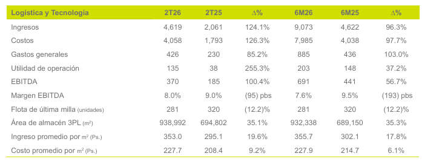

Margen Logistica y tecnología 6M25: 148 / 4,622 = 3.20%
Para 6M26: 2.24%

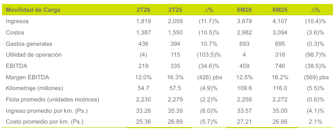

Margen Movilidad de carga 6M25: 7.74%
Para 6M26: 0.11%.

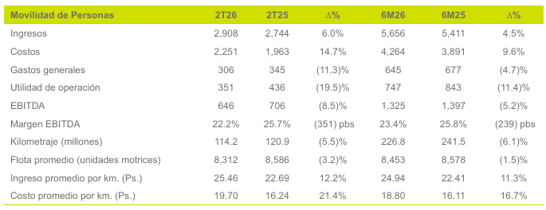

Margen Movilidad de personas 6M25: 15.58%
Para 6M26: 13.21%

Los segmentos caen pero Movilidad de carga se desploma.
Marge consolidado 6M25: 8.74%
Margen consolidado 6M26: 4.93%, el mismo reportado en "Construcción de los ultimos doce meses a junio 2026"

Decisión del Margen:
Se adopta el escenario en que movilidad de carga recupera su margen de 7.74%, mientras logística y personas se quedan donde están hoy.
un segmento no opera indefinidamente en pérdida. Carga cayó por causas identificadas y reversibles como alza del combustible por el conflicto en Medio Oriente, incertidumbre arancelaria, peso fuerte frente a ingresos en dólares. La empresa ya anunció alzas de precios y salida de activos no rentables.

Este supuesto deja un Margen de 6.45% como base.

**AÑO BASE**

Ingresos base: 38082.2
Margen operativo supuesto: 6.45%
EBIT base: 38,082.2 * 6.45% = 2,456.3

## 2026-07-28 - Construcción de los ultimos doce meses a junio 2026

El año base debe representar a la empresa que se va a valorar: Traxión con Solistica, operando doce meses. Ningún ejercicio anual cumple eso. Solistica consolida desde el 1 de julio de 2025, así que 2025 solo
tiene seis meses y 2026 aún no cierra.

El día de hoy se verificó que Traxion ya publicó el 2T26. Esto permite tener un periodo de doce meses completos con SOlistica y no tener que anualizar el aporte de seis meses.

**Construcción** 
Se armara con una identidad como esta:
UDM Julio2025-Junio2026 = Año2025 completo - 1Semestre2025 + 1Semestre 2026

El año 2025 ya esta en la serie histórica; 1S25 y 1S26 salen ambos del reporte 2T26, columnas 6M25 y 6M26.

Evidentemente la identidad solo aplica para flujos cmo ingresos, EBIT, DyA, gasto por intereses, impuestos, capex. Las cuentas de balance se toman directo del corte al 20 de junio de 2026.

La empresa reporta razones de apalancamiento sobre EBITDA UDM (p. 8 del 2T26): deuda total / EBITDA UDM = 2.66x y deuda neta / EBITDA UDM = 2.40x, con su propia definición de deuda (14,016, que excluye IFRS 16).

Reproducir esas dos cifras con el EBITDA UDM construido aquí sirve de prueba: si coinciden, la construcción de la ventana es correcta, ya que se llega a un dato publicado sin haberlo usado para armarla.

**Fuentes**
- Reporte Trimestral 2T26: estado de resultados (p. 14), estado de flujos de efectivo (p. 15), estado de situación financiera (p. 13), perfil de la deuda (p. 8).
- Serie histórica 2021-2025 en data/interim/traxion_anual.csv.

Tras esta decisión se agrega una fila al CSV con anio = 2026.5 para que ordene despues de 2025. La serie anual 2021-2025 no se modifica.

**Resultado**

| Concepto | UDM jul25-jun26 |
|---|---|
| Ingresos | 38,082.2 |
| EBIT | 2,152.3 |
| EBIT normalizado | 2,163.5 |
| D&A | 3,111.4 |
| EBITDA | 5,263.7 |
| Gasto por intereses | 1,753.8 |
| Deuda ajustada (jun-26) | 15,935.7 |
| Efectivo (jun-26) | 1,383.0 |
| Capital contable (jun-26) | 14,260.9 |

Con la definición de deuda de la empresa (14,016, excluye IFRS 16):

14,016 / 5,263.7 = 2.66x   coincide con lo reportado
12,633 / 5,263.7 = 2.40x   coincide

está bien construida: reproduce dos cifras publicadas que no se usaron para armarla.

Con la deuda ajustada adoptada en este proyecto (15,935.7), el apalancamiento real es 3.03x bruto y 2.76 neto, casi cuatro décimas
por encima de lo que comunica la empresa.

**Hallazgo: el margen no se recuperó**

| Período | Margen EBIT |
|---|---|
| 2023 | 9.31% |
| 2024 | 9.21% |
| 2025 | 7.37% |
| UDM a jun-26 | 5.68% |
| 1S26 | 4.93% |
| 2T26 | 4.83% |

La cobertura de intereses sigue la misma trayectoria: 1.40x en 2025, 1.23x en los UDM.

Esto contradice el supuesto de recuperación parcial que se venía manejando. La evidencia disponible dice que el deterioro continúa y que
el trimestre más reciente es el peor de la serie.

**Limitación**

Los reportes trimestrales no incluyen reconciliación de EBITDA ajustado, a diferencia de los anuales. No es posible identificar partidas no recurrentes del 1S26. El EBIT normalizado UDM puede estar subestimado si la reorganización generó costos de una sola vez.

## 2026-07-28 - Descomposicion organica: crecimiento y margen

Calculado con src/datos.py (funciones serie_organica y margenes) sobre data/interim/traxion_anual.csv.

**Crecimiento 2024 . 2025**

| Medida | Calculo | Resultado |
|---|---|---|
| Consolidado | 33814.1 / 29141.7 - 1 | 16.03% |
| Organico | 30078.2 / 29141.7 - 1 | 3.21% |

Casi 13 puntos de diferencia. El crecimiento consolidado esta inflado por la adquisicion: el negocio base crecio 3.2%, no 16%. Proyectar sobre a cifra consolidada sobreestimaria el valor de forma severa.
La tasa relevante para la proyeccion es la organica. Que es lo que ya se intuia.

**Margen operativo**

| Concepto | Margen EBIT norm. |
|---|---|
| 2024 (todo organico) | 9.21% |
| 2025 organico (Traxion sin Solistica) | 7.34% |
| Solistica sola (6 meses) | 7.67% |
| 2025 consolidado | 7.37% |

**Correccion de un diagnostico anterior** 

La entrada del 2026-07-26 atribuia la caida de margen de 2025 al cambio de mezcla por Solistica.
La descomposicion muestra que es falso: el margen de Solistica (7.67%) esta por encima del margen del negocio base en 2025 (7.34%), de modo que la adquisicion elevo levemente el margen consolidado.

La caida de 9.21% a 7.34% ocurre en el negocio original de Traxion.

**Implicaciones**

- El deterioro de rentabilidad es del negocio base, no un efecto contable. Hay que explicarlo: candidatos son el alza de combustible, la caida de volumen y precio en movilidad de carga por incertidumbre arancelaria, y el efecto cambiario sobre ingresos en USD (los tres mencionados  en el 1T26).
- Esto reabre la pregunta del margen base: si el deterioro es ciclico,el margen normalizado deberia acercarse al historico (~9%); si es estructural, al nivel actual (~7.4%). La respuesta determina el ano base y, con el, buena parte de la valoracion.

## 2026-07-26 - Decisión del año base (YA NO APLICA DEBIDO A QUE TRAXION YA PUBLICO 2T26)

**Problema**

La empresa a valorar (2026 en adelante) incluye Solistica el año completo pero ningún año de la serie representa eso:
- 2021-2024: sin Solistica se subestima el tamaño
- 2025: híbrido, solo 6 meses de Solistica, con factores transitorios (combustible, trimestre atípico).
- 2026 completo: aún no existe. El 2T26 no se ha publicado.

**Lo que muestra la serie (EBIT normalizado):**

Con el csv armado se puede observar que:

Margen EBIT normalizado: ebit_normalizado / ingresos_totales
Y Cobertura de interees: ebit_normalizado / gasto_intereses

| Año | Margen EBIT norm. | Cobertura intereses |
|---|---|---|
| 2021 | 11.12% | 3.30x |
| 2022 | 8.29% | 1.88x |
| 2023 | 9.31% | 1.58x |
| 2024 | 9.21% | 1.60x |
| 2025 | 7.37% | 1.40x |

El negocio operó en 8-9% de margen en 2022-2024. La caída a 7.4% en 2025 coincide con Solistica.
[Corregido el 2026-07-28: la descomposicion organica muestra que la
caida no proviene de la mezcla por Solistica. Vease entrada de esa fecha.]

**Crecimiento real (sin Solistica):**

Ingresos 2025 = 33,814 − 3,736 = 30,078.
Contra 2024 (29,142): crecimiento cercani a 3.2%. El 16% consolidado es mayormente adquisición, no crecimiento del negocio base.

**Decisión**

Ante la probelamatica se decide que el año base no se va a copiar de ningún año sino que se va a construir.
- Tamaño (ingresos base): Traxión sin solistica + Solistica anualizada, para intentar reflejar la empresa completa de hoy.
- Rentabilidad (margen base): margen EBIT normalizado de mediano plazo (8-9% histórico)
- Los factores transitorios de 2025 (combustible, trimestre) seexcluyen; el efecto estructural de la mezcla post-Solistica se conserva.

## 2026-07-25 - Verificación de 2021,2022 y 2023 y márgenes normalizados

Cifras convertidas a millones de pesos. 

**2021, 2022 y 2023 son años limpios:** la reconciliación de EBITDA sin reestructura, sin ganancias po adquisición. ebit_normalizado = ebit = 2,310.5.

**Hallazgo - la caída de márgenes era en parte un espejismo:**
con EBIT normalizado, el margen operativo es 9.31% (2023), 9.21% (2024) y 7.37% (2025). El deterioro aparente de 2024 (8.43% con EBIT crudo) se debía a los gastos de reestructura; al normalizar, 2023 y 2024 quedan casi iguales. El desplome real ocurre solo en 2025, coincidiendo con Solistica.
A investigar.

**Discrepancia de efectivo en 2021:** el balance reporta 1,260.7, pero otra sección del reporte muestra 1,335.1 para el mismo año. Se adopta el valor del balance (estado financiero primario). 

## 2026-07-25 - Verificación de 2024 y ubicación de partidas no recurrentes

Cifras convertidas a millones de pesos. 

**Verificación**
Ingresos y EBIT de 2024 son idénticos en el reporte 2024 y en la comparativa del reporte 2025. 
Se usa el reporte 2024 como fuente.

**EBIT normalizado 2024 = 2,685.3**

EBIT reportado: 2,457.1
+ 228.2 gastos por reestructura anotado en el desglose del EBITDA.
el estado de resultados no tiene línea propia de reestructura, por lo que el gasto está dentro de la utilidad de operación. Por eso sí
se ajusta al EBIT, a diferencia de la ganancia por adquisición de 2025, que está debajo del EBIT y no se ajusta.

**Deuda total 2024 = 13,625.9** (suma de 6 líneas, incluye IFRS 16).

## 2026-07-25 - Serie anual:verificación de 2025

Cifras convertidas a millones de pesos. 

**Verificaciones**

- PyG (ingresos, EBIT, DyA, intereses, utilidad neta, impuesto base fiscal, utilidad antes de impuestos)
- capex_flota: La cifra es "Adquisiciones de equipo de transporte y maquinaria" del estado de flujos.
- capex_adquisiciones: "Contraprestación por adquisición de negocios" (Solistica).
- deuda_total: 16,019.4, armada sumando las seis líneas de deuda del balance (incluye obligaciones por arrendamiento IFRS 16, según el
criterio ya adoptado). El balance anual agrupa el arrendamiento capitalizable e IFRS 16 en una sola línea, a diferencia del trimestral que los desglosa.
- efectivo (1,600.2) y capital_contable (14,444.4)

**Contribución de Solistica (6 meses, jul-dic 2025), según nota d combinaciones de negocios:**

- Ingresos: 3,735.9
- Utilidad de operación: 286.6
Permite construir la serie orgánica (sin Solistica) por diferencia.

**EBIT normalizado 2025 = 2,493.2**

- EBIT reportado: 2,482.0
- + 11.2 de costos de adquisición de Solistica (auditoría, legales, notariales), reconocidos en gastos generales no recurrentes.
- La ganancia por adquisición de negocios (42.7) no se ajusta en el EBIT: en el estado de resultados aparece debajo de la utilidad deoperación, en el bloque financiero. Solo afectaría un EBIT/utilidad neta normalizados, no el EBIT operativo.

## 2026-07-25 - Fecha de discontinuidad de la integración de Solistica

En el 1T26 se observó que los ingresos de logística crecian rapidamente por la integración de Solistica.
Dicha adquisición rompe la serie histórica en dos. Pues si la empresa compra otra compañia grande, los años anteriores 
y posteriores no son comparables por composición.

Se revisa el reporte anual de 2025 para poder saber esta fecha de corte.

**Qué se encontro**

"En julio de 2025 adquirimos Solistica, una empresa líder de servicios logísticos propiedad de Grupo FEMSA y con 
operaciones en tres países: México, Brasil y Colombia. De manera simultánea, vendimos las operaciones de Brasil y 
Colombia, por lo que TRAXION únicamente adquirió operaciones y activos de México, por una inversión neta de Ps. 
1,650 millones." 

"el 1 de julio de 2025 Grupo  Traxión adquirió el 100% de las acciones con derecho a voto de Solística. 
Por lo anterior, los ingresos, costos y gastos de Solística no forman parte del estado de resultados consolidado de Grupo Traxión 
por los primeros seis meses del año 2025, ni por los años completos 2024 y 2023. Así mismo, los activos y pasivos de Solística no forman parte del estado de situación financiera consolidado de Grupo Traxión al 31 de diciembre de 2024 y 2023" 

"En julio 2025 realizamos una disposición por 1,600 millones del crédito sindicado para la adquisición de 
Solística." 

"Así mismo el 1º de julio de 2025 simultáneamente se llevó a cabo la venta de las operaciones de Solística 
en Brasil y Colombia, el precio pactado por esta transacción fue de $2,381,631" 

"Por los seis meses terminados desde la fecha de adquisición al 31 de diciembre de 2025 Solística contribuyó 
a los resultados del Grupo con un total de $3,735,889 de ingresos y aportó una utilidad de operación de 
$286,567." 

"En el año terminado el 31 de diciembre de 2025, Grupo Traxión incurrió en costos relacionados con la 
adquisición de Solistica por $11,200 principalmente relacionadas con auditoria de compra, honorarios legales 
y notariales, los cuales fueron reconocidos en gastos generales" 

"El 1º de julio de 2025 se llevó a cabo la adquisición y venta simultanea de las subsidiarias de Solistica 
correspondientes a las operaciones de Brasil y Colombia, mismas que clasificadas cómo disponibles para la 
venta y reconocidas a su valor razonable menos costos estimados de venta por un monto de $2,381,631   El 
precio de la venta fue el mismo que el costo de la compra, por lo que no se generaron pérdidas o ganancias 
en esta transacción. La razón de la venta fue por enfocar los esfuerzos estratégicos del Grupo en México y 
Estados Unidos" 

**Decisión**

La serie deja de ser comparable a partir del 2025. Concretamente a partir de julio. 
Se puede considerar 2025 como un año híbrido: seis meses de la Traxión vieja y seis meses de la Traxión con Solistica. 
No es comparable ni con 2024 ni con 2026.

La empresa manifiesta que "Solística contribuyó con $3,735,889 de ingresos y aportó una utilidad de operación de $286,567" (seis meses).
Esto puede permitir construir una serie orgánica y comparable (Traxion sin solistica, 2021-2025)
Ejemplo: Ingresos 2025 sin Solistica = Ingresos totales 2025 - 3,736

Para efectos de valoración lo relevante es que Traxion se quedo solo con Mexico financiado con 1,600 de disposición del crédito sindicado.
Deuda bancaria.

Los 11,2 de costos de adquisición hacen caer la utilidad de 2025 por el evento mencionado. Es un gasto no recurrente por lo que se tendrá
en cuenta cuando se normalice EBIT.

Otros ajustes para tener en cuenta al normalizar EBIT en 2025:

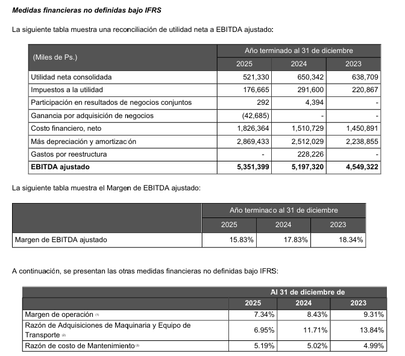

- Ganancia por adquisicion
- gastos por reestructura

La empresa ofrece su EBITDA ya calculado, es util como referencia pero se usará EBIT para valorar, la depreciación es relevante
en transportadora que consume flota. Tambien, la empresa decide los ajustes que le conviene resaltar. Por eso se contruye Ebit normalizado propio.

## 2026-07-22 - Cobertura de intereses del 1T26 y rating sintético

Fuente: Reporte Trimestral 1T26, p. 14 (Estado de Resultados).
Cifras en miles de pesos.

**Qué se encontro**

Cobertura de intereses = Utilidad de operación / Gasto por intereses

455,825 / 430,990 = 1.06

para el 1T25:

689,545 / 463,036 = 1.49

**Rating sintético implícito**

Aplicando la tabla de calificaciones sintéticas por índice de cobertura para empresas grandes no financieras:

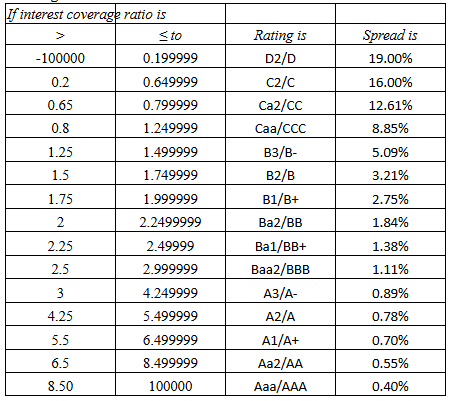

*Fuente: Damodaran, "Ratings, Interest Coverage Ratios and Default Spread". Consultado 2026-07-22.*

Para 1T2026:
    Rating sintético implícito: Caa/CCC
    Spread por incumplimiento asociado: 8,85%

**Calificación real de Fitch**

Pendiente de obtener.

**Criterio aplicado**

El rating sintético se estima con el EBIT normalizado, no con el de un trimestre aislado. Un único trimestre golpeado por alza de combustible y caída de volumen en carga no es base válida para asignar calificación.
De igual forma, este rating sintetico esta en dólares. Traxion reporta en pesos,  aplicar este spread en dólares a una tasa libre de riesgo en pesos mezcla monedas. Esto se resolverá en  el Modulo 2.

**Decisión**

El número se registra como observación preliminar. El cálculo definitivo se hace en el Módulo 2, con la corrección de la divisa, el EBIT normalizado  sobre serie anual, y con el gasto financiero que corresponda a la definición de deuda ya adoptada (16,518, incluyendo IFRS 16).

**Implicaciones**

- Este es el contraste que motivó elegir Traxión: permite medir cuánto se desvía el rating sintético del real cuando ambos existen. En una
empresa privada solo se dispone del sintético, sin forma de verificarlo.
- Pendiente: obtener el reporte de Fitch y verificar qué definición de deuda y qué EBIT utiliza. Si Fitch excluye IFRS 16 como lo hace la
compañía, los ratios no son comparables sin ajuste.

## 2026-07-22 - Reestructuración anunciada en movilidad de carga

Fuente: Reporte Trimestral 1T26, p. 3 (Mensaje del Presidente Ejecutivo).

**Qué se encontro**

La administración anuncia un plan de ajuste.

Objetivo declarado: reducir base de costos y bajar el apalancamiento hacia el cierre del año.

Contexto: la guía original para 2026 era crecimiento de ~10% en ingresos y EBITDA con margen cercano a 16%. El 1T26 cerró con margen
de 13.7%.

**Criterio aplicado**

Un anuncio de reestructuración modifica la trayectoria futura de capex, márgenes y base de activos, que son insumos directos de la proyección de flujos.

**Decisión**

Se registra como hecho conocido a la fecha de valoración. No se incorpora a los supuestos: faltaría verificar ejecución en los trimestres siguientes.

## 2026-07-22 - El 1T26 no es un trimestre representativo

Fuente: Reporte Trimestral 1T26, p. 5 (Análisis de Resultados).

**Qué se encontro** 

La administración advierte contra usar este trimestre como base:

- El 1T25 fue "un trimestre particularmente favorable en términos financieros y operativos", y los trimestres siguientes se vieron afectados por fenómenos geopolíticos.
- El margen EBITDA del 1T26 (13.7%) se ubica "en un nivel atípico comparado con las operaciones regulares de la compañía".
- La compañía se describe a sí misma "en una etapa de normalización operativa".

Factores no recurrentes identificados en el trimestre:

Conflicto militar en Medio Oriente
Incertidumbre arancelaria
Fortaleza del peso
Integración de Solistica

**Criterio aplicado**

La base de proyección debe reflejar la capacidad normal de generación del negocio, no un punto atípico del ciclo. Ni el 1T25 ni el
1T26 sirven aislados.

**Decisión**

Pendiente. La elección de año base se resuelve con la serie anual completa, no con este documento.

**Implicaciones**

- El año base no puede ser un trimestre anualizado.
- La advertencia de la empresa sobre el 1T25 obliga a revisar si 2024
y 2025 tienen distorsiones equivalentes.

## 2026-07-22 - Arrendamientos y definición de deuda

Fuente: Reporte Trimestral 1T26, pp. 8 y 13. Cifras en millones MXN.

**Qué se encontro**

La empresa reporta una "Deuda total" de 14,484 (p. 8), compuesta por:
deuda CP 1,290 + arrend. capitalizable CP 2 + deuda LP 13,192
+ arrend. capitalizable LP 0.

Clasificando línea por línea el pasivo del balance (p. 13) según los
criterios de deuda, el total asciende a 16,518:

| Línea | Monto |
|---|---|
| Venc. circulante de deuda a largo plazo | 1,070 |
| Deuda bursátil circulante | 220 |
| Obligaciones por arrendamiento capitalizable CP | 2 |
| Obligaciones por arrendamiento IFRS 16 CP | 884 |
| Deuda bancaria a largo plazo | 8,692 |
| Deuda bursátil a largo plazo | 4,500 |
| Obligaciones por arrendamiento capitalizable LP | 0 |
| Obligaciones por arrendamiento IFRS 16 LP | 1,150 |
| **Total deuda** | **16,518** |

Conciliación: deuda 16,518 + pasivos no financieros 8,978
= 25,496 = total del pasivo. 

**Diferencia: 2,034 (+14.0%)**, correspondiente íntegramente a las obligaciones por arrendamiento bajo IFRS 16.

**Qué dice la empresa**

Pie de nota 5 de la tabla de PERFIL DE LA DEUDA (p. 8): la deuda total está calculada "basado en la definición de deuda como lo
determina el crédito sindicado". Es decir, una definición contractual, no una definición económica.

**Criterio aplicado**

Definición de deuda típica en Finanzas Corpotativas de profesores como
Aswath Damodaran basada en 3 criterios: compromiso contractual de
pago, deducibilidad fiscal del pago, y pérdida de control del activo
ante incumplimiento. Un arrendamiento bajo IFRS 16 cumple las tres: hay
calendario contractual de cuotas, el componente de interés es
deducible, y el incumplimiento faculta al arrendador a recuperar el
activo. El balance lo reconoce como pasivo y registra su
contrapartida en el activo por derecho de uso (2,046).

**Decisión**

Se adopta 16,518 como deuda para todos los cálculos del modelo. La cifra de 14,484 se conserva únicamente como referencia de lo que
reporta la empresa.

**Implicaciones**

- Ponderaciones del costo de capital: la D del WACC sube 14%.
- Beta ascendente: el D/E de reapalancamiento cambia.
- Rating sintético: la cobertura de intereses se calcula con el gasto
financiero que incluye el componente de interés de los arrendamientos.
- Deuda neta: 15,101 en lugar del 13,067 reportado en la pag 8.
- Comparabilidad: al cotejar apalancamiento contra comparables del
sector hay que verificar si ellos también excluyen IFRS 16. Si se
compara la cifra ajustada de Traxión contra la cifra reportada de
otros, Traxión aparece artificialmente más endeudada.

## 2026-07-22 - Módulo 1 iniciado

Estructura del repositorio creada. Primer commit.
Alcance: Valoración FCFF completa y se incluye módulo de estructura óptima
de capital porque Traxión tiene rating real de Fitch contra el cual calibrar un cronograma
de costo de deuda kd.